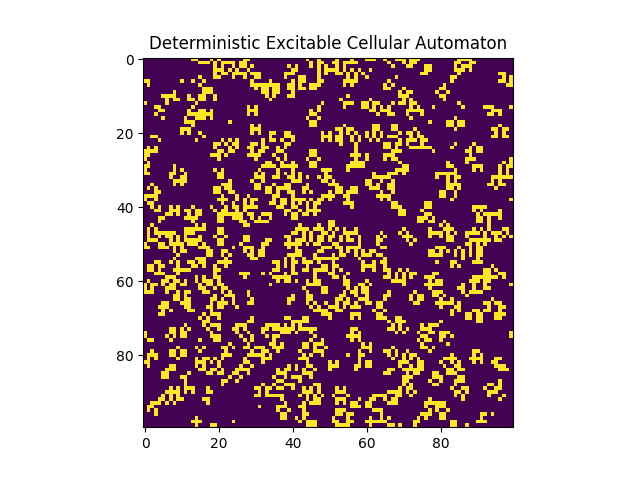

# Deterministic Excitable Cellular Automaton
**Emergent Wave Dynamics from Local Threshold Rules**

This model is a **deterministic discrete simulation framework** that demonstrates how complex spatiotemporal excitation patterns can emerge from simple local interaction rules on a 2D grid.

Instead of solving global differential equations, the system uses **nearest-neighbor deterministic update rules** inspired by excitable media dynamics — akin to action potential propagation in neurons and excitable tissues.

Built using **NumPy + Matplotlib**, the engine simulates the time evolution of discrete waves and visualizes emergent behavior arising from neighbor interactions.

---

## Key Features

* **Discrete Lattice Representation:** 100×100 grid with deterministic update rules.
* **Three-State Excitable Dynamics:** States cycle through Resting, Excited, Refractory.
* **Periodic Boundary Conditions:** Wrap-around edges create a seamless topology.
* **Nearest-Neighbor Interactions:** Moore neighborhood (8 directions).
* **Visual Animation Output:** Produces a simulation GIF of emergent wave patterns.
* **Parameter Tunable:** You can adjust grid size, initial activity, and threshold rules.

---

## The Core Idea: Local Rules → Global Dynamics

Excitable systems can support wave propagation even when each element only “sees” its nearest neighbors.

In this system, each cell $(x, y)$ takes one of the discrete states:

| State Code | Meaning        |
|------------|----------------|
| `0`        | Resting (OFF)  |
| `1`        | Excited (ON)   |
| `2`        | Refractory     |

The evolution of the grid is **fully deterministic** — no stochastic elements — and patterns emerge solely from the interaction between neighboring cells.

---

## Mathematical Framework

### Lattice and Neighborhood

Grid size:


Neighborhood used: **Moore neighborhood**

$$
\mathcal{N}(x, y) = \{g(x+dx,\,y+dy)\ :\ dx,dy ∈ \{-1,0,1\},\ (dx,dy)≠(0,0)\}
$$

Periodic boundary conditions are applied, making the grid behave like a torus.

---

## Update Rules

The grid evolves through discrete time steps according to deterministic local rules:

### Rule 1 — Excitation Threshold

A **resting cell** becomes **excited** if it has exactly **two neighboring excited cells**:

$$
g_{t+1}(x,y)=1 \quad \text{if} \quad g_t(x,y)=0 \;\land\; |\{n∈\mathcal{N}(x,y): n=1\}| = 2
$$

### Rule 2 — Refractory Transition

An **excited cell** always becomes **refractory** at the next step:

$$
g_{t+1}(x,y)=2 \quad \text{if} \quad g_t(x,y)=1
$$

### Rule 3 — Recovery

A **refractory cell** always returns to the **resting state**:

$$
g_{t+1}(x,y)=0 \quad \text{if} \quad g_t(x,y)=2
$$

Despite their simplicity, these rules produce rich spatiotemporal structure.

---

## Implementation

The simulation is coded in:


Key packages used:

* `numpy` — for efficient array operations  
* `matplotlib` — for visualization and animation  
* `matplotlib.animation.FuncAnimation` — for generating GIF output  

The simulation initializes the grid with 10% of cells in the ON state and evolves the system for a fixed number of frames while saving the animation as a GIF.

---

## Visual Results

### Simulation Animation

<p align="center">
  
</p>

This animation visualizes the emergent propagation waves over discrete time steps.

---

## How to Run

### Dependencies

Install required packages:

```bash
pip install -r requirements.txt
